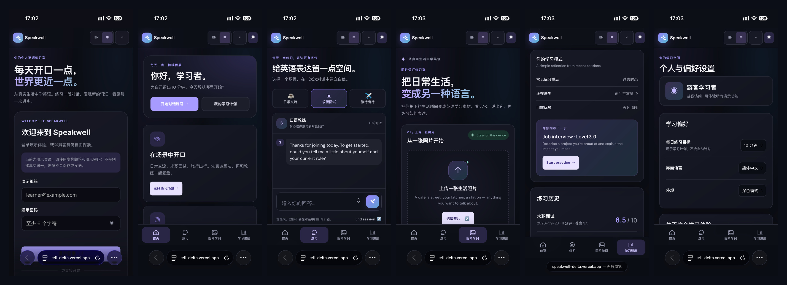
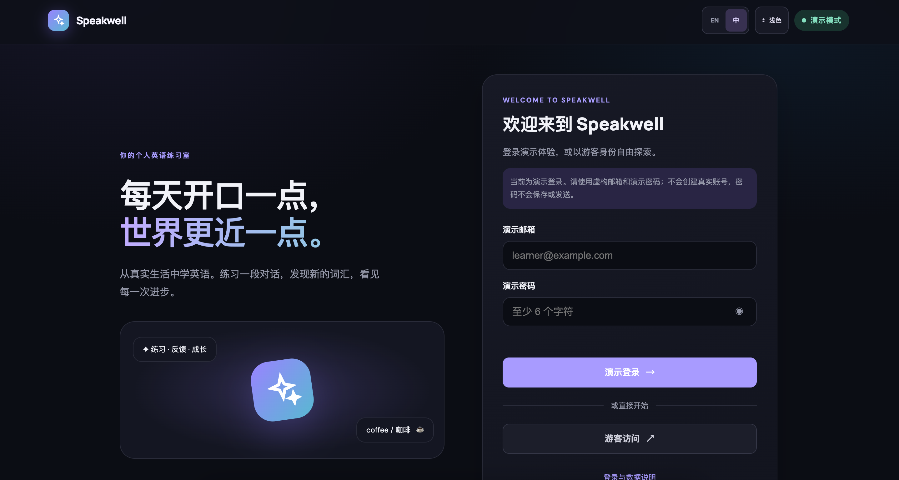
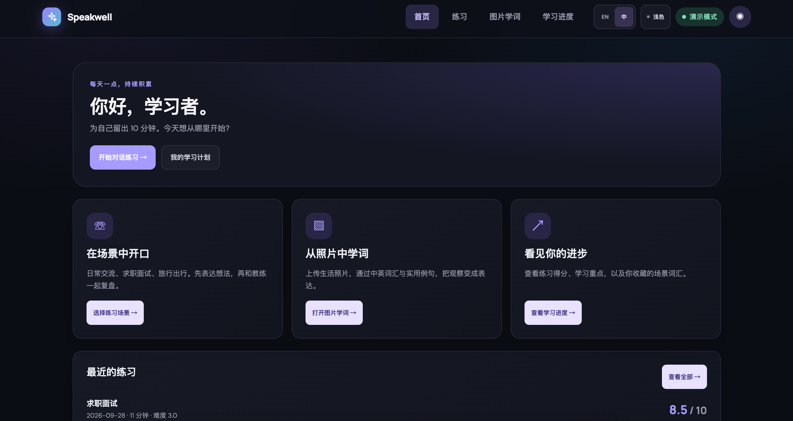
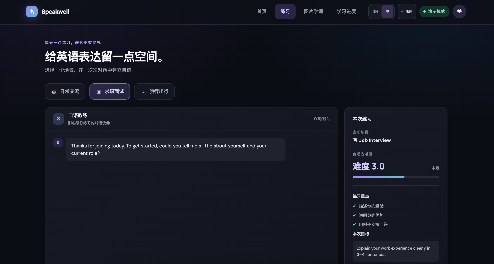
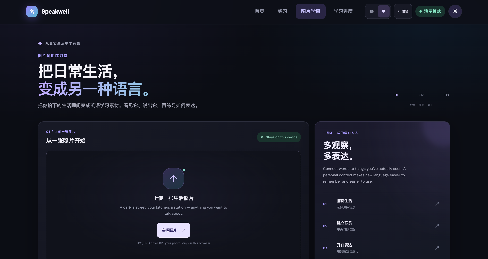

# Speakwell · AI Speaking Coach

An interactive English-learning portfolio demo exploring AI × Education, learning science, and visual experience design.

**[Open the interactive demo](https://speakwell-delta.vercel.app/)** on your phone or computer. Choose **Continue as guest / 游客访问** to explore all demo features.

## Demo Preview

### Mobile · Six screens

Login → Learning Home → Scenario Practice → Photo Learn → Learning Progress → Profile & Preferences.

These are screenshots captured on an iPhone, including its browser controls. The collage preserves the original screen content.

### Desktop · Welcome & demo sign-in

### Desktop · Learning Home

### Desktop · Scenario Practice

### Desktop · Photo Learn

The covers illustrate the product concept; the previews show the current interactive demo.

## App flow & features

- **Welcome:** demo sign-in, guest entry, and login/data guidance. Demo sign-in accepts a fictional email and a password of at least six characters; it does not create or authenticate an account. Passwords are neither stored nor transmitted.
- **Learning Home:** feature shortcuts, a daily planning goal, and recent practice records.
- **Scenario Practice:** text conversations for daily life, job interviews, and travel. Curated coach replies keep the conversation flowing without immediate correction.
- **Session Feedback:** a demonstration score, strengths, a next-step focus, and grammar, vocabulary, and expression feedback cards. You can repeat the scenario or view progress.
- **Photo Learn:** upload a personal photo, select a scene category, explore English/Chinese vocabulary and example sentences, hear phrases using browser text-to-speech, and save words.
- **Learning Progress:** session totals, average scores, a score chart, practice history, sample learning patterns, and saved vocabulary.
- **Profile & Preferences:** daily planning goal, English / Simplified Chinese interface, light / dark appearance, data guidance, and sign-out. Some learning examples remain in English in Chinese mode.
- **Responsive layout:** desktop navigation and a mobile bottom navigation bar. Open `mobile-preview.html` locally for a phone-size interactive preview.

## Demo scope

This is a portfolio prototype built with HTML, CSS, and JavaScript. It uses curated dialogue, sample feedback, and scene vocabulary; it does not currently call a live AI service.

- Uploaded photos are previewed locally. Vocabulary and label positions come from the selected scene category, not recognition of the image's contents. Image recognition and image generation are not implemented.
- Feedback examples do not evaluate the learner's actual text. Scores and practice minutes are demonstration estimates, not validated proficiency measurements or a real timer.
- Completing a demo session increases the demonstration difficulty by 0.5, up to Level 5. This is not yet a performance-based adaptive algorithm.
- The initial four practice records and learning-pattern summaries are samples. Newly completed demo sessions and saved words are stored in the current browser.
- The microphone button is a placeholder; voice input is not implemented. Phrase playback depends on browser text-to-speech support and available voices.
- The daily goal is a planning preference, without automatic timing or reminders. Real accounts, cloud storage, and cross-device synchronization are not implemented.

## Run locally

Open `index.html` in a browser, or serve this folder with any static web server. No build step or API key is needed for the demo.

## Deployment

The current public demo is hosted on [Vercel](https://speakwell-delta.vercel.app/) using a manual folder deployment. GitHub updates do not currently trigger an automatic deployment.

To enable automatic deployments later, import this repository into Vercel, choose **Other** as the framework, keep the root directory at the repository root, and leave the build command empty. The entry point is `index.html`.

## Learning design

The prototype explores comprehensible input, delayed feedback, and contextual vocabulary learning. These principles guide the interaction design; the project does not claim validated learning outcomes.

## Data

Learning records, saved words, and preferences use localStorage in each browser. Guest and demo sign-in share those local records. Access state uses sessionStorage; signing out retains learning records. Uploaded photos stay in memory in the browser and are lost on reload. Google Fonts is used for typography.
