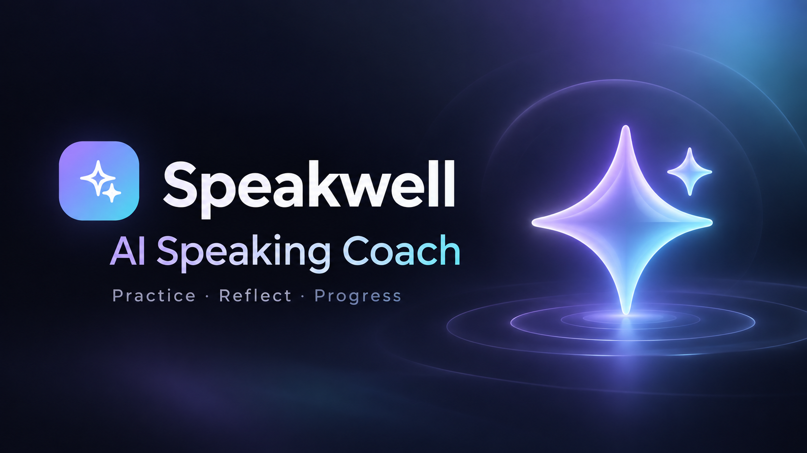
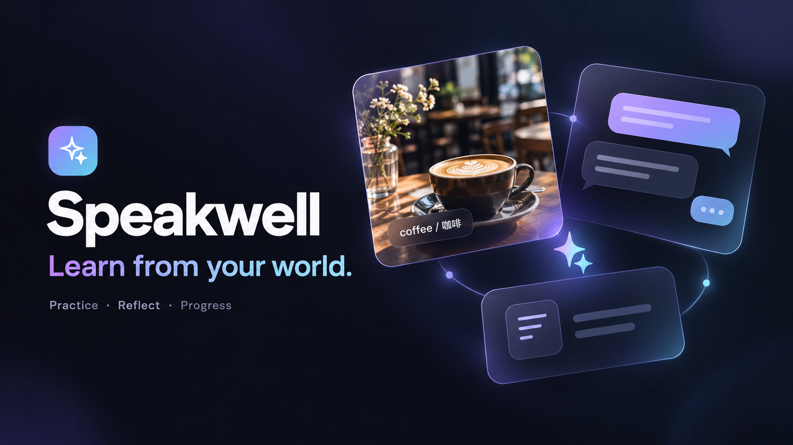
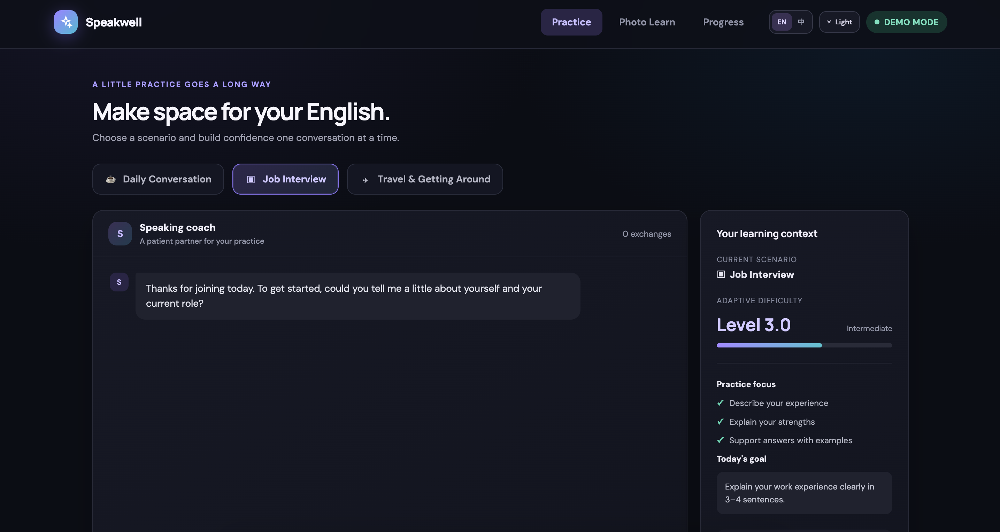
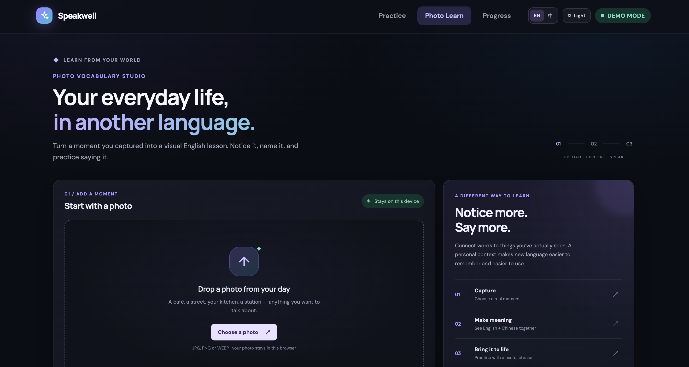

# Speakwell · AI Speaking Coach

An interactive English-learning portfolio demo exploring AI × Education, learning science, and visual experience design.

## Demo preview

### Scenario practice

### Photo Learn

The covers illustrate the product concept; screenshots show the current interactive demo.

## Local app entry

- Open the app to see the sign-in screen; choose **Continue as guest** to use every demo feature.
- Demo sign-in accepts a fictional email and a password of at least six characters. It does not create or authenticate an account; passwords are not stored or transmitted.
- Learning Home provides feature entry points and recent practice records.
- Profile includes language, appearance, a daily planning goal, data guidance and sign-out.
- Open `mobile-preview.html` for an interactive phone-size preview.

## Features

- Scenario-based English practice: daily conversation, job interviews, and travel.
- End-of-session feedback with grammar, vocabulary, and expression suggestions.
- Learning progress dashboard and demonstration difficulty adjustments.
- Photo Learn: upload a personal photo, explore bilingual scene vocabulary, hear phrases, and save words.
- English / Simplified Chinese interface and light / dark themes.
- Browser-local learning records and preferences.

## Demo scope

This version uses curated dialogue, feedback, and photo vocabulary. It does not call a live AI service or recognize the contents of uploaded photos. Voice input and real account authentication are not implemented. The local app includes a clearly labelled demo sign-in flow and guest access.

## Run locally

Open `index.html` in a browser, or serve this folder with any static web server.

## Deploy to Vercel

Import this repository into Vercel. Choose **Other** as the framework, keep the root directory at the repository root, and use no build command. The site entry point is `index.html`.

## Learning design

The prototype explores comprehensible input, delayed feedback, and contextual vocabulary learning. Scores and difficulty changes are demonstration heuristics; the project does not claim validated learning outcomes.

## Data

Practice records and preferences are stored in localStorage in each browser. Uploaded photos remain in the browser in this demo. Google Fonts is used for typography.
